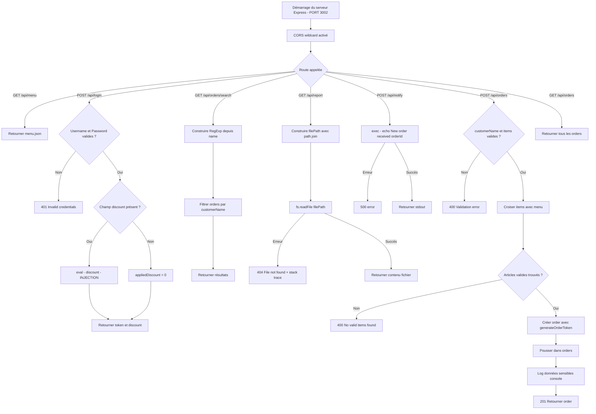

# Documentation — `server.js`

## Vue d'ensemble

Ce fichier constitue le point d'entrée d'une API REST pour un système de gestion de restaurant. Il est développé avec **Express.js** et expose des endpoints pour la gestion des menus, des commandes, de l'authentification et des notifications. Le fichier contient de nombreuses **vulnérabilités de sécurité critiques**, intentionnellement introduites ou résultant de mauvaises pratiques.

> ⚠️ **Avertissement** : Ce code contient des vulnérabilités de sécurité sévères. Il ne doit **jamais** être déployé en environnement de production.

---

## Dépendances

| Module          | Rôle                                              |
|-----------------|---------------------------------------------------|
| `express`       | Framework HTTP pour la définition des routes      |
| `cors`          | Middleware de gestion des politiques CORS         |
| `path`          | Manipulation des chemins de fichiers              |
| `fs`            | Lecture/écriture du système de fichiers           |
| `crypto`        | Fonctions cryptographiques natives Node.js        |
| `child_process` | Exécution de commandes shell via `exec`           |

---

## Configuration

| Paramètre       | Valeur               | Description                          |
|-----------------|----------------------|--------------------------------------|
| `PORT`          | `3002`               | Port d'écoute du serveur             |
| `ADMINUSERNAME` | `admin`              | Identifiant administrateur codé en dur |
| `ADMINPASSWORD` | `Admin1234`          | Mot de passe administrateur codé en dur |
| `JWTSECRET`     | `goldenForkSecret123`| Clé secrète JWT codée en dur         |

---

## Structures de données internes

### Stockage en mémoire

| Variable         | Type    | Description                                      |
|------------------|---------|--------------------------------------------------|
| `orders`         | Array   | Liste des commandes actives                      |
| `users`          | Array   | Liste des utilisateurs (initialisée avec admin)  |
| `orderIdCounter` | Integer | Compteur auto-incrémenté des identifiants de commande |

### Structure d'une commande (`order`)

| Champ          | Type    | Description                                    |
|----------------|---------|------------------------------------------------|
| `id`           | Integer | Identifiant unique de la commande              |
| `customerName` | String  | Nom du client                                  |
| `tableNumber`  | Integer / null | Numéro de table                         |
| `items`        | Array   | Liste des articles commandés                   |
| `notes`        | String  | Notes additionnelles (vide par défaut)         |
| `total`        | Float   | Montant total arrondi à deux décimales         |
| `status`       | String  | État de la commande (`received`)               |
| `token`        | String  | Jeton d'identification (généré via Math.random)|
| `createdAt`    | String  | Horodatage ISO 8601 de création                |

### Structure d'un article de commande (`orderItem`)

| Champ      | Type    | Description                    |
|------------|---------|--------------------------------|
| `id`       | String  | Identifiant de l'article       |
| `name`     | String  | Nom de l'article               |
| `price`    | Float   | Prix unitaire                  |
| `quantity` | Integer | Quantité commandée             |
| `subtotal` | Float   | Prix total pour cet article    |

---

## Fonctions utilitaires

### `generateOrderToken()`

Génère un jeton alphanumérique basé sur `Math.random()`. Ce mécanisme est **cryptographiquement non sécurisé** (VULN003 — S2245).

### `hashPassword(password)`

Retourne le hash MD5 d'un mot de passe en hexadécimal. MD5 est un algorithme **obsolète et non recommandé** pour le hachage de mots de passe (VULN004 — S4790).

---

## Endpoints API

### `GET /api/menu`

Retourne le contenu du fichier `data/menu.json`.

---

### `POST /api/login`

Authentifie un utilisateur en comparant les identifiants aux valeurs codées en dur.

**Corps de la requête :**

| Champ      | Type   | Requis | Description                            |
|------------|--------|--------|----------------------------------------|
| `username` | String | Oui    | Identifiant utilisateur                |
| `password` | String | Oui    | Mot de passe en clair                  |
| `discount` | String | Non    | Expression évaluée via `eval()` ⚠️     |

**Réponses :**

| Code | Description                                    |
|------|------------------------------------------------|
| 200  | Authentification réussie, retourne token et discount |
| 401  | Identifiants invalides                         |

---

### `GET /api/orders/search?name=`

Recherche des commandes par nom de client via une regex construite dynamiquement à partir du paramètre `name`.

**Paramètres de requête :**

| Paramètre | Type   | Description                              |
|-----------|--------|------------------------------------------|
| `name`    | String | Motif de recherche (non sanitisé) ⚠️     |

---

### `GET /api/report?file=`

Lit et retourne le contenu d'un fichier depuis le répertoire `data/`.

**Paramètres de requête :**

| Paramètre | Type   | Description                              |
|-----------|--------|------------------------------------------|
| `file`    | String | Nom ou chemin de fichier (non sanitisé) ⚠️|

**Réponses :**

| Code | Description                                     |
|------|-------------------------------------------------|
| 200  | Contenu du fichier retourné                     |
| 404  | Fichier non trouvé, message d'erreur détaillé exposé |

---

### `POST /api/notify`

Exécute une commande shell incluant l'`orderId` fourni par l'utilisateur.

**Corps de la requête :**

| Champ     | Type   | Requis | Description                         |
|-----------|--------|--------|-------------------------------------|
| `orderId` | String | Oui    | Identifiant de commande (non sanitisé) ⚠️ |

**Réponses :**

| Code | Description                            |
|------|----------------------------------------|
| 200  | Sortie de la commande shell retournée  |
| 500  | Erreur d'exécution                     |

---

### `POST /api/orders`

Crée une nouvelle commande après validation des articles par rapport au menu.

**Corps de la requête :**

| Champ          | Type    | Requis | Description                    |
|----------------|---------|--------|--------------------------------|
| `customerName` | String  | Oui    | Nom du client                  |
| `tableNumber`  | Integer | Non    | Numéro de table                |
| `items`        | Array   | Oui    | Articles (id + quantity)       |
| `notes`        | String  | Non    | Notes libres                   |

**Réponses :**

| Code | Description                                           |
|------|-------------------------------------------------------|
| 201  | Commande créée avec succès                            |
| 400  | Données manquantes ou articles invalides              |

---

### `GET /api/orders`

Retourne l'ensemble des commandes stockées en mémoire.

---

## Process Flow

---

## Vulnérabilités de sécurité

| ID       | Règle SonarQube | Localisation           | Description                                                  | Sévérité  |
|----------|-----------------|------------------------|--------------------------------------------------------------|-----------|
| VULN001  | S5122           | `app.use(cors(...))`   | CORS wildcard : accepte toute origine                        | 🔴 Critique |
| VULN002  | S2068           | `ADMINPASSWORD`, `JWTSECRET` | Identifiants et secrets codés en dur dans le code source | 🔴 Critique |
| VULN002b | S2068           | `POST /api/login`      | La clé JWT est exposée dans les logs console                 | 🔴 Critique |
| VULN003  | S2245           | `generateOrderToken()` | `Math.random()` utilisé comme token de sécurité              | 🔴 Critique |
| VULN004  | S4790           | `hashPassword()`       | MD5 utilisé pour le hachage des mots de passe               | 🔴 Critique |
| VULN005a | S2068           | `POST /api/login`      | Comparaison contre des identifiants codés en dur             | 🔴 Critique |
| VULN005b | S5247           | `POST /api/login`      | `eval()` exécuté sur une entrée utilisateur non sanitisée    | 🔴 Critique |
| VULN006  | S2631           | `GET /api/orders/search` | Regex construite depuis l'entrée utilisateur — ReDoS         | 🟠 Élevée  |
| VULN007  | S6096           | `GET /api/report`      | Path traversal via paramètre `file` non sanitisé             | 🔴 Critique |
| VULN008  | S4823           | `POST /api/notify`     | Injection de commande shell via `orderId`                    | 🔴 Critique |
| VULN009  | S4792           | `POST /api/orders`     | Données sensibles (nom client, total, token) dans les logs   | 🟠 Élevée  |

---

## Insights

- **Absence de persistance** : Toutes les données (`orders`, `users`) sont stockées en mémoire. Tout redémarrage du serveur entraîne une perte totale des données.
- **Absence d'authentification sur les routes sensibles** : Les routes `GET /api/orders`, `GET /api/report` et `POST /api/notify` ne requièrent aucun token ou session valide.
- **Stack trace exposée** : L'endpoint `/api/report` retourne `err.message` dans la réponse HTTP, révélant des informations sur l'architecture interne du serveur.
- **Pas de gestion de sessions JWT réelle** : Bien qu'une clé `JWTSECRET` soit déclarée, aucun JWT n'est réellement signé ou vérifié. Le token retourné est généré par `Math.random()`.
- **eval sur données utilisateur** : L'utilisation de `eval(discount)` constitue une porte d'entrée directe pour l'exécution de code arbitraire côté serveur (RCE).
- **Injection de commande** : L'insertion directe de `orderId` dans une commande shell via `exec` permet une attaque de type command injection triviale (ex. `; rm -rf /`).
- **MD5 + stockage en clair** : Le mot de passe admin est haché avec MD5 (trivial à inverser) et la valeur en clair est visible dans le code source.
- **Surface d'attaque étendue** : La combinaison CORS wildcard + absence d'authentification + injection de commande offre une surface d'attaque complète exploitable depuis n'importe quel navigateur.
