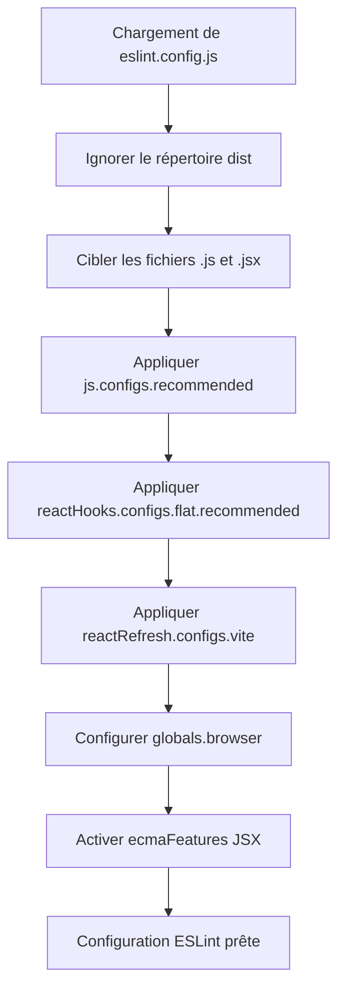

# Configuration ESLint — `eslint.config.js`

## Vue d'ensemble

Ce fichier est la **configuration ESLint** du projet. Il utilise le format plat (*flat config*) introduit dans ESLint v9, exposé via `defineConfig`. Il définit les règles de linting applicables aux fichiers JavaScript et JSX du projet, en intégrant des plugins spécifiques à l'écosystème React.

---

## Dépendances

| Import | Source | Rôle |
|---|---|---|
| `js` | `@eslint/js` | Configurations recommandées ESLint pour JavaScript |
| `globals` | `globals` | Définition des variables globales par environnement |
| `reactHooks` | `eslint-plugin-react-hooks` | Règles de linting pour les Hooks React |
| `reactRefresh` | `eslint-plugin-react-refresh` | Règles de linting pour React Fast Refresh (Vite) |
| `defineConfig` | `eslint/config` | Utilitaire de définition de la configuration ESLint flat |
| `globalIgnores` | `eslint/config` | Utilitaire de déclaration des chemins ignorés |

---

## Structure de la configuration

### Fichiers ignorés

```
dist/
```

Le répertoire `dist` est exclu de l'analyse statique, ce qui est la pratique standard pour les artefacts de build.

---

### Fichiers ciblés

| Motif | Description |
|---|---|
| `**/*.js` | Tous les fichiers JavaScript |
| `**/*.jsx` | Tous les fichiers JSX (composants React) |

---

### Extensions (Règles appliquées)

| Règle / Config | Source | Description |
|---|---|---|
| `js.configs.recommended` | `@eslint/js` | Règles JavaScript recommandées par ESLint |
| `reactHooks.configs.flat.recommended` | `eslint-plugin-react-hooks` | Applique les règles `rules-of-hooks` et `exhaustive-deps` |
| `reactRefresh.configs.vite` | `eslint-plugin-react-refresh` | Valide la compatibilité des composants avec le Fast Refresh de Vite |

---

### Options de langage

| Option | Valeur | Description |
|---|---|---|
| `globals` | `globals.browser` | Expose les variables globales du navigateur (`window`, `document`, etc.) |
| `ecmaFeatures.jsx` | `true` | Active le support syntaxique JSX dans le parser |

---

## Process Flow



---

## Insights

- Ce fichier utilise le **format flat config** d'ESLint, qui remplace l'ancien format basé sur `.eslintrc`. Il nécessite ESLint **v9+** ou v8 avec le flag expérimental activé.
- L'utilisation de `reactRefresh.configs.vite` indique que ce projet est bundlé avec **Vite**, et que le Fast Refresh est activé en développement.
- L'activation de `globals.browser` évite les fausses erreurs ESLint sur les APIs natives du navigateur considérées comme non définies.
- La combinaison `rules-of-hooks` + `exhaustive-deps` fournie par `eslint-plugin-react-hooks` est essentielle pour prévenir des bugs subtils liés à l'utilisation incorrecte des Hooks React.
- L'absence de configuration `node` dans les `globals` confirme que ce projet est exclusivement orienté **client-side**.
