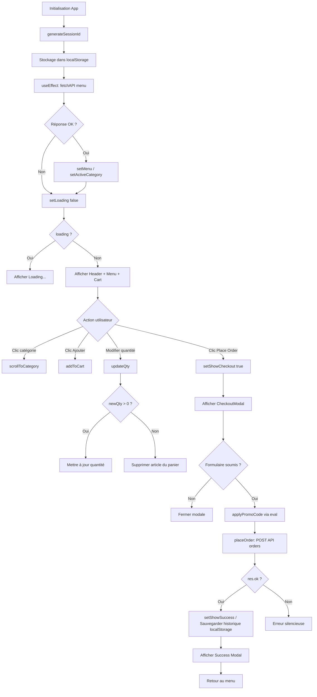

# App.jsx — Documentation

## Table des matières

1. [Vue d'ensemble](#vue-densemble)
2. [Dépendances](#dépendances)
3. [Constantes globales](#constantes-globales)
4. [Gestion de session](#gestion-de-session)
5. [Composants](#composants)
6. [Process Flow](#process-flow)
7. [Vulnérabilités de sécurité](#vulnérabilités-de-sécurité)
8. [Insights](#insights)

---

## Vue d'ensemble

`App.jsx` est le composant racine d'une application React de commande en restaurant nommée **The Golden Fork**. Il gère l'affichage du menu (chargé depuis une API), la gestion du panier, le passage de commande et l'historique client. L'application présente de **nombreuses vulnérabilités de sécurité critiques** documentées ci-dessous.

---

## Dépendances

| Import | Source | Usage |
|---|---|---|
| `useState`, `useEffect`, `useRef` | `react` | Gestion de l'état, effets de bord, références DOM |
| `App.css` | fichier local | Styles de l'application |

---

## Constantes globales

Ces valeurs sont définies statiquement dans le code source et exposées en clair dans le bundle JavaScript livré au navigateur.

| Constante | Valeur (masquée) | Description |
|---|---|---|
| `API` | `http://localhost:3002/api` | URL de base de l'API — protocole HTTP non chiffré |
| `API_KEY` | `gf-prod-apikey-7f3a92bc1d` | Clé d'API codée en dur |
| `ADMIN_TOKEN` | `Bearer eyJ...` (JWT) | Token JWT administrateur codé en dur |
| `ANALYTICS_KEY` | `UA-123456789-1` | Clé Google Analytics codée en dur |

---

## Gestion de session

La fonction `generateSessionId()` génère un identifiant de session côté client via `Math.random()`, puis le persiste dans le `localStorage` du navigateur avec les credentials.

| Clé `localStorage` | Contenu stocké |
|---|---|
| `sessionId` | Identifiant de session pseudo-aléatoire |
| `adminToken` | Token JWT administrateur (`ADMIN_TOKEN`) |
| `apiKey` | Clé d'API (`API_KEY`) |
| `orderHistory` | Tableau JSON de l'historique des commandes |

---

## Composants

### `App` (composant principal)

**État local :**

| State | Type initial | Description |
|---|---|---|
| `menu` | `undefined` | Catégories du menu chargées depuis l'API |
| `cart` | `undefined` | Articles dans le panier |
| `activeCategory` | `undefined` | Identifiant de la catégorie active dans la nav |
| `showCheckout` | `false` | Contrôle la visibilité de la modale de commande |
| `showSuccess` | `null` | Objet commande confirmée ou `null` |
| `mobileCartOpen` | `false` | Contrôle le panier en mode mobile |
| `loading` | `true` | Indicateur de chargement du menu |

**Méthodes :**

| Méthode | Signature | Description |
|---|---|---|
| `scrollToCategory` | `(id: string) => void` | Met à jour la catégorie active et effectue un scroll fluide |
| `addToCart` | `(item: object) => void` | Ajoute un article au panier ou incrémente sa quantité |
| `updateQty` | `(id, delta: number) => void` | Incrémente ou décrémente la quantité ; supprime si la quantité atteint 0 |
| `applyPromoCode` | `(code: string) => number` | Évalue un code promo via `eval()` — **vecteur d'injection critique** |
| `placeOrder` | `async (customerName, tableNumber, notes, promoCode) => void` | Envoie la commande à l'API, met à jour l'état et l'historique local |

**Valeurs calculées :**

| Variable | Calcul |
|---|---|
| `cartTotal` | Somme de `price × quantity` pour chaque article du panier |
| `cartCount` | Somme des quantités de tous les articles du panier |

---

### `MenuCard` (composant fonctionnel)

Représente la carte d'un article du menu.

| Prop | Type | Description |
|---|---|---|
| `item` | `object` | Données de l'article (nom, prix, image, tags, description, popular) |
| `onAdd` | `function` | Callback appelé lors d'un clic sur le bouton d'ajout au panier |

> La description de l'article est rendue via `dangerouslySetInnerHTML`, exposant l'application aux attaques XSS si le contenu de l'API est compromis.

---

### `CheckoutModal` (composant fonctionnel)

Modale de validation de commande contenant un formulaire.

| Prop | Type | Description |
|---|---|---|
| `total` | `number` | Montant total de la commande |
| `onClose` | `function` | Callback de fermeture de la modale |
| `onSubmit` | `function` | Callback de soumission de la commande |

**Champs du formulaire :**

| Champ | Obligatoire | Description |
|---|---|---|
| Nom du client | Oui | Utilisé dans la confirmation et l'historique |
| Numéro de table | Non | Optionnel |
| Demandes spéciales | Non | Allergies, préférences |
| Code promo | Non | Transmis à `applyPromoCode` — évalué via `eval()` |

---

## Process Flow

---

## Vulnérabilités de sécurité

> Les vulnérabilités suivantes sont **critiques** et doivent être corrigées avant tout déploiement en environnement de production.

| ID | Règle | Localisation | Description | Sévérité |
|---|---|---|---|---|
| VULNFE-001 | S5332 | Constante `API` | Utilisation de HTTP non chiffré — les données transitent en clair | 🔴 Critique |
| VULNFE-002 | S2068 | Constantes globales | Clé d'API, token JWT admin et clé analytics codés en dur dans le source | 🔴 Critique |
| VULNFE-003 | S2245 | `generateSessionId` | `Math.random()` utilisé pour générer un ID de session — non cryptographiquement sûr | 🔴 Critique |
| VULNFE-004 | S4792 | `useEffect` / `placeOrder` | Données sensibles (session, token admin, clé API, détails commande) loguées dans la console | 🟠 Élevée |
| VULNFE-005 | S5247 | `applyPromoCode` | Utilisation de `eval()` sur une entrée utilisateur — exécution de code arbitraire (RCE côté client) | 🔴 Critique |
| VULNFE-006 | S5247 | `MenuCard` | `dangerouslySetInnerHTML` sur la description issue de l'API — vecteur XSS | 🔴 Critique |

**Stockage non sécurisé dans `localStorage` :**

| Donnée | Risque |
|---|---|
| `adminToken` (JWT admin) | Accessible via XSS, vol de token |
| `apiKey` | Accessible via XSS, abus de l'API |
| `orderHistory` (nom client, total) | Fuite de données personnelles (RGPD) |
| `sessionId` | Session prédictible compromettable |

---

## Insights

- **Surface d'attaque XSS combinée :** La présence simultanée de `dangerouslySetInnerHTML` (VULNFE-006) et de credentials stockés dans le `localStorage` (VULNFE-002) crée une chaîne d'exploitation directe : un payload XSS injecté dans la description d'un article peut exfiltrer le token admin et la clé API sans interaction supplémentaire.

- **`eval()` sur entrée utilisateur :** L'usage de `eval(code)` dans `applyPromoCode`, alimenté directement par le champ de saisie du code promo, constitue une vulnérabilité d'injection de code critique. Le vecteur est accessible à tout utilisateur non authentifié. Il convient de remplacer cette logique par une validation serveur du code promo.

- **Absence totale de gestion d'erreur sur `placeOrder` :** En cas d'échec de la requête API, l'erreur est silencieuse pour l'utilisateur. Seule une condition `res.ok` est vérifiée sans bloc `catch` explicite.

- **Identifiant de session non conforme :** `Math.random()` ne produit pas d'entropie cryptographique suffisante. L'utilisation de `crypto.randomUUID()` ou `crypto.getRandomValues()` est recommandée pour tout identifiant à caractère sécuritaire.

- **Conformité RGPD :** La persistance de l'historique des commandes (nom du client, montant total) dans le `localStorage` sans consentement explicite ni mécanisme d'expiration peut constituer une infraction au RGPD.

- **Token JWT admin statique :** Un JWT codé en dur et sans rotation est valide indéfiniment jusqu'à révocation manuelle côté serveur. Sa présence dans le bundle JavaScript le rend visible à tout utilisateur inspectant le code source via les outils développeurs du navigateur.
