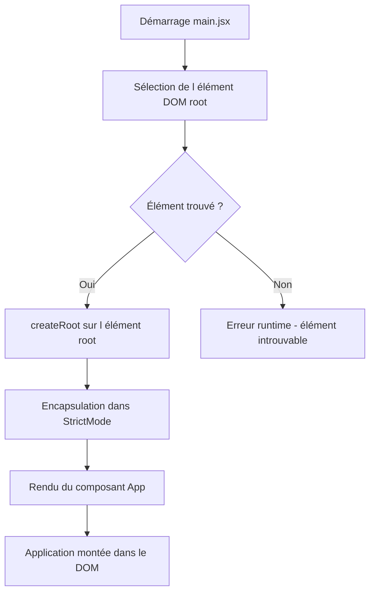

# Documentation — `main.jsx`

## Vue d'ensemble

Point d'entrée principal de l'application React. Ce fichier initialise et monte l'application dans le DOM en utilisant l'API `createRoot` de React 18, avec activation du mode strict.

---

## Dépendances

| Module | Source | Rôle |
|---|---|---|
| `StrictMode` | `react` | Active les vérifications et avertissements supplémentaires en développement |
| `createRoot` | `react-dom/client` | API React 18 pour le rendu concurrent |
| `App` | `./App.jsx` | Composant racine de l'application |
| `index.css` | `./index.css` | Styles globaux de l'application |

---

## Comportement

1. Sélectionne l'élément DOM portant l'identifiant `root` via `document.getElementById('root')`.
2. Crée une racine React sur cet élément via `createRoot`.
3. Rend le composant `<App />` encapsulé dans `<StrictMode>`.

---

## Process Flow

---

## Insights

- L'utilisation de `createRoot` est obligatoire pour bénéficier des fonctionnalités React 18, notamment le **rendu concurrent** (`Concurrent Rendering`).
- `StrictMode` n'a **aucun impact en production** ; il est uniquement actif en environnement de développement pour détecter les effets de bord involontaires et les API dépréciées.
- L'élément HTML avec l'id `root` doit impérativement exister dans le fichier `index.html` du projet pour éviter une erreur d'exécution.
- Ce fichier constitue le **seul point d'entrée** du bundler (Vite, Webpack, etc.) vers l'arbre de composants React.
