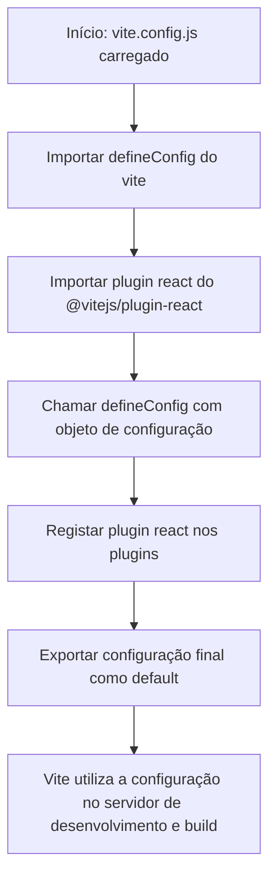

# Documentação — `vite.config.js`

## Visão Geral

Ficheiro de configuração principal do **Vite**, responsável por definir as opções de build e desenvolvimento do projeto. Neste cas, configura o Vite para trabalhar com aplicações **React**.

---

## Dependências

| Módulo                    | Origem                    | Descrição                                                              |
|---------------------------|---------------------------|------------------------------------------------------------------------|
| `defineConfig`            | `vite`                    | Utilitário que fornece suporte a IntelliSense e validação de tipagem para a configuração do Vite |
| `react`                   | `@vitejs/plugin-react`    | Plugin oficial do Vite que adiciona suporte ao React, incluindo Fast Refresh e transformação de JSX |

---

## Estrutura de Configuração

| Propriedade | Valor     | Descrição                                                                 |
|-------------|-----------|---------------------------------------------------------------------------|
| `plugins`   | `[react()]` | Ativa o plugin React, habilitando JSX, Fast Refresh e otimizações de build |

---

## Configuração Exportada

A configuração é exportada como **`default`** através da função `defineConfig`, garantindo validação estática e autocompletar em editores compatíveis com TypeScript/JSDoc.

```js
export default defineConfig({
  plugins: [react()],
});
```

---

## Process Flow



---

## Insights

- A utilização de `defineConfig` é uma **boa prática recomendada** pela documentação oficial do Vite, pois oferece inferência de tipos sem necessidade de configuração adicional de TypeScript.
- O plugin `@vitejs/plugin-react` utiliza internamente o **Babel** para transformações JSX e suporte ao React Fast Refresh em modo de desenvolvimento.
- Esta configuração representa o **ponto de entrada mínimo viável** para um projeto React com Vite, podendo ser expandida com opções como `server`, `build`, `resolve`, `css`, entre outras.
- A ausência de configurações adicionais indica que o projeto adota os **valores padrão do Vite**, que incluem servidor de desenvolvimento na porta `5173` e build otimizado para produção com Rollup.
