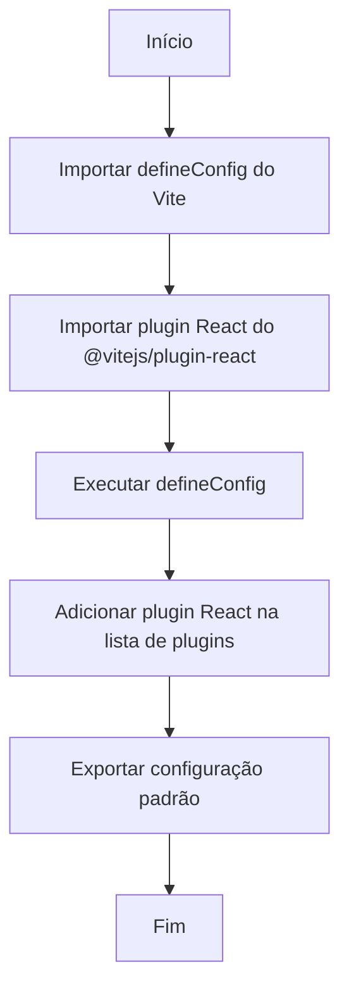

# Documentação Técnica — `vite.config.js`

## Visão Geral

Este arquivo contém a **configuração principal** de um projeto utilizando **Vite** com o **plugin React**.  
Ele define como o ambiente de construção, desenvolvimento e empacotamento será configurado pela ferramenta Vite.

## Estrutura do Código

| Tipo de Conteúdo | Descrição |
|------------------|------------|
| Importações | Importação do método `defineConfig` do Vite e do plugin `react` |
| Definição de Configuração | Exportação padrão de uma configuração Vite utilizando `defineConfig` |
| Plugin Ativado | `@vitejs/plugin-react` é inserido na lista de plugins do projeto |

## Componentes Principais

### Importações
- **`defineConfig`**: Função auxiliar do Vite para permitir definições tipadas e organizadas da configuração.
- **`react()`**: Plugin que integra o ambiente React ao processo de build do Vite.

### Configuração Exportada
A configuração exportada contém apenas uma chave:
- **`plugins`**: Lista de plugins utilizados — neste caso, somente o plugin React é habilitado.

## Process Flow

## Insights

- A configuração é **mínima e otimizada**, ideal para iniciar rapidamente projetos React com Vite.
- É recomendável complementar este arquivo com definições específicas, como **além de plugins**, **configurações de build**, **proxy**, ou **optimizadores**.
- O uso de `defineConfig` facilita o suporte a **TypeScript** e a **autocompletar IDE**, tornando mais segura e clara a declaração de configurações.
